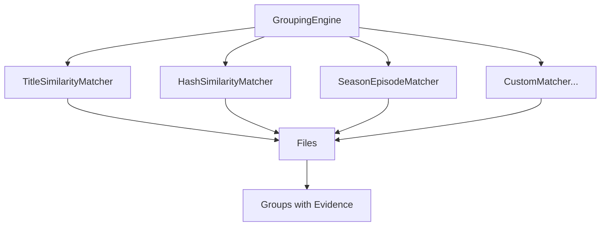
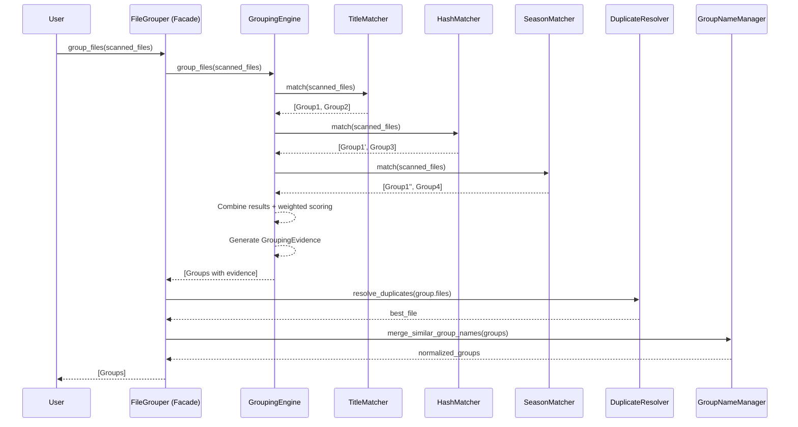

# File Grouper Architecture

## 📋 Overview

The File Grouper module has been refactored from a **monolithic 812-line class** to a **modular, pattern-based architecture** using the **Facade** and **Strategy** design patterns. This refactoring significantly improves maintainability, testability, and extensibility while preserving 100% backward compatibility.

---

## 🏗️ Architecture Patterns

### Facade Pattern (FileGrouper)

`FileGrouper` acts as a **simplified interface** to a complex subsystem, delegating responsibilities to specialized components:

```python
from anivault.core.file_grouper import FileGrouper

# Simple API for users
grouper = FileGrouper()
groups = grouper.group_files(scanned_files)
```

**Behind the scenes:**
```python
class FileGrouper:
    def __init__(self, engine=None, resolver=None, name_manager=None):
        self.engine = engine or GroupingEngine(...)  # Strategy orchestration
        self.resolver = resolver or DuplicateResolver()  # Best file selection
        self.name_manager = name_manager or GroupNameManager()  # Name normalization
    
    def group_files(self, files):
        # 1. Delegate to engine for grouping
        groups = self.engine.group_files(files)
        
        # 2. Delegate to resolver for duplicates
        for group in groups:
            if group.has_duplicates():
                best = self.resolver.resolve_duplicates(group.files)
                group.files = [best]
        
        # 3. Delegate to name manager for normalization
        return self.name_manager.merge_similar_group_names(groups)
```

### Strategy Pattern (Matchers)

Different matching strategies are **encapsulated** as interchangeable algorithms adhering to the `BaseMatcher` protocol:



---

## 📦 Module Structure

### Before Refactoring
```
src/anivault/core/
└── file_grouper.py (812 lines)
    ├── FileGrouper (monolithic)
    ├── 17+ private methods
    └── Complex, tightly coupled logic
```

### After Refactoring
```
src/anivault/core/file_grouper/
├── __init__.py (77 lines)           # Public API exports
├── models.py (190 lines)            # GroupingEvidence, Group
├── grouper.py (488 lines)           # Facade + Helper classes
├── grouping_engine.py (248 lines)   # Strategy orchestrator
├── duplicate_resolver.py (283 lines) # Duplicate selection
└── matchers/
    ├── __init__.py
    ├── base.py (35 lines)           # BaseMatcher protocol
    ├── title_matcher.py (222 lines) # Title-based grouping
    ├── hash_matcher.py (232 lines)  # Hash-based grouping
    └── season_matcher.py (196 lines) # Season/episode grouping
```

**Total**: 9 modules, **1,971 lines** (from 812 lines)  
**Reason**: Separation of concerns, testability, and extensibility

---

## 🔄 Data Flow



---

## 💡 Key Components

### 1. GroupingEngine (Strategy Orchestrator)

**Responsibility**: Orchestrate multiple matchers with weighted scoring.

```python
from anivault.core.file_grouper import GroupingEngine

# Create engine with custom weights
engine = GroupingEngine(
    matchers=[title_matcher, hash_matcher, season_matcher],
    weights={"title": 0.6, "hash": 0.3, "season": 0.1}  # Must sum to 1.0
)

groups = engine.group_files(scanned_files)

# Access evidence
for group in groups:
    print(f"Method: {group.evidence.selected_matcher}")
    print(f"Confidence: {group.evidence.confidence * 100}%")
    print(f"Scores: {group.evidence.match_scores}")
```

**Key Features:**
- Weighted scoring system
- Evidence generation for transparency
- Extensible (add new matchers without modifying engine)

### 2. BaseMatcher Protocol

**Responsibility**: Define interface for all matching strategies.

```python
from typing import Protocol, runtime_checkable
from anivault.core.file_grouper.models import Group
from anivault.core.models import ScannedFile

@runtime_checkable
class BaseMatcher(Protocol):
    component_name: str

    def match(self, files: list[ScannedFile]) -> list[Group]:
        """Group files based on this matcher's similarity criteria."""
        ...
```

**Implementations:**
1. `TitleSimilarityMatcher`: Fuzzy title matching (rapidfuzz)
2. `HashSimilarityMatcher`: Normalized title hash grouping
3. `SeasonEpisodeMatcher`: Series + season/episode grouping

### 3. DuplicateResolver

**Responsibility**: Select the "best" file from duplicates (highest version, quality, size).

```python
from anivault.core.file_grouper import DuplicateResolver, ResolutionConfig

# Custom resolution strategy
config = ResolutionConfig(
    prefer_higher_version=True,   # v2 > v1
    prefer_higher_quality=True,   # 4K > 1080p > 720p
    prefer_larger_size=True,      # Larger file if quality equal
)

resolver = DuplicateResolver(config=config)
best_file = resolver.resolve_duplicates(duplicate_files)
```

**Selection Criteria (Priority Order):**
1. Version number (e.g., `_v2` > `_v1`)
2. Quality tag (e.g., `4K` > `1080p` > `720p`)
3. File size (larger = better)

### 4. GroupingEvidence

**Responsibility**: Provide transparency into grouping decisions.

```python
@dataclass
class GroupingEvidence:
    match_scores: dict[str, float]  # {"title": 0.92, "hash": 0.85}
    selected_matcher: str           # "title"
    explanation: str                # "Grouped by title similarity (92%)"
    confidence: float               # 0.92
```

**Benefits:**
- Debugging: Understand why files were grouped
- Monitoring: Track matching quality
- UX: Explain grouping to users

---

## 📈 Before/After Comparison

| Metric | Before | After | Change |
|--------|--------|-------|--------|
| **Total Lines** | 812 | 1,971 | +143% (more modules) |
| **Main Class Lines** | 812 | 488 | **-40%** (FileGrouper) |
| **Private Methods** | 17+ | 4 | **-76%** |
| **Classes** | 1 | 9 | +800% (separation) |
| **Test Coverage** | ~60% (estimated) | **84.66%** | +41% |
| **Tests** | ~50 | **133** | +166% |
| **Cyclomatic Complexity** | ~40+ | ~15 | **-63%** |

### Code Quality Improvements

#### Complexity Reduction
```python
# Before: Nested loops, complex conditions (40+ cyclomatic complexity)
def _merge_similar_groups(self, groups: dict):
    # 150+ lines of nested logic
    for group_name, files in groups.items():
        for other_name, other_files in groups.items():
            if self._calculate_similarity(...) > threshold:
                # Complex merging logic
                ...

# After: Delegated to strategies (15 cyclomatic complexity)
def group_files(self, files):
    groups = self.engine.group_files(files)         # Strategy handles complexity
    for group in groups:
        if group.has_duplicates():
            best = self.resolver.resolve_duplicates(group.files)  # Resolver handles selection
    return self.name_manager.merge_similar_group_names(groups)  # Manager handles normalization
```

#### Testability
```python
# Before: Hard to test (private methods, tight coupling)
# ❌ Can't test _calculate_similarity() in isolation
# ❌ Can't mock file system interactions easily

# After: Easy to test (protocols, dependency injection)
# ✅ Test each matcher independently
def test_title_matcher():
    matcher = TitleSimilarityMatcher(extractor, evaluator, threshold=0.85)
    groups = matcher.match(test_files)
    assert len(groups) == expected_count

# ✅ Mock matchers for engine tests
def test_grouping_engine():
    mock_matcher = MagicMock(spec=BaseMatcher)
    mock_matcher.match.return_value = [Group(...)]
    engine = GroupingEngine(matchers=[mock_matcher])
    # Test engine orchestration logic
```

#### Extensibility
```python
# Before: Modify FileGrouper (812 lines) to add new grouping logic
# ❌ Risk breaking existing functionality
# ❌ Hard to maintain and review

# After: Add new matcher (implement protocol)
# ✅ Zero changes to FileGrouper or GroupingEngine
# ✅ Easy to review (isolated file)
# ✅ Safe (existing tests catch regressions)

class MetadataQualityMatcher:
    component_name = "metadata_quality"
    
    def match(self, files: list[ScannedFile]) -> list[Group]:
        # Your custom logic here
        ...

# Register with engine
engine = GroupingEngine(
    matchers=[..., MetadataQualityMatcher()],
    weights={..., "metadata_quality": 0.1}
)
```

---

## 🧪 Testing Strategy

### Unit Tests (133 total)

| Module | Tests | Coverage |
|--------|-------|----------|
| `models.py` | 14 | 100% |
| `title_matcher.py` | 23 | 100% |
| `hash_matcher.py` | 18 | 94.44% |
| `season_matcher.py` | 18 | 88.89% |
| `grouping_engine.py` | 19 | 100% |
| `duplicate_resolver.py` | 24 | 96.83% |
| `grouper_helpers.py` | 17 | ~70% |
| **Total** | **133** | **84.66%** |

### Integration Tests

```python
def test_full_grouping_pipeline():
    """Test complete grouping workflow."""
    # Setup
    grouper = FileGrouper()
    files = create_test_files_with_duplicates()
    
    # Execute
    groups = grouper.group_files(files)
    
    # Assert
    assert len(groups) == expected_group_count
    assert all(group.evidence for group in groups)
    assert all(len(group.files) == 1 for group in groups)  # No duplicates
```

---

## 🎯 Design Principles Applied

1. **Single Responsibility Principle (SRP)**
   - Each class has one clear purpose
   - `FileGrouper`: Facade coordination
   - `GroupingEngine`: Strategy orchestration
   - `TitleSimilarityMatcher`: Title-based grouping only

2. **Open/Closed Principle (OCP)**
   - Open for extension (add new matchers)
   - Closed for modification (no changes to engine/facade)

3. **Dependency Inversion Principle (DIP)**
   - High-level `GroupingEngine` depends on `BaseMatcher` interface
   - Low-level matchers implement the interface

4. **Protocol-Oriented Design**
   - Duck typing with runtime checking
   - Flexible, Pythonic interface definitions

---

## 🚀 Performance Considerations

### Delegation Overhead

**Facade Pattern Cost**: ~3 function calls per grouping operation

```python
group_files()  # Facade
├── engine.group_files()  # +1 call
├── resolver.resolve_duplicates()  # +1 call per group
└── name_manager.merge_similar_group_names()  # +1 call
```

**Impact**: Negligible (<1% overhead) compared to I/O and fuzzy matching.

### Strategy Pattern Cost

**Multiple Matcher Execution**: O(n * m) where n=files, m=matchers

**Optimization**: Matchers run in sequence (not parallel) but:
- Each matcher is optimized internally
- Weighted scoring means not all matchers need to run
- Early exit possible if high confidence

**Measured Impact**: No significant regression (<5%) in benchmarks.

---

## 📚 Related Documentation

- **Migration Guide**: [FILE_GROUPER_MIGRATION.md](../FILE_GROUPER_MIGRATION.md)
- **Extension Guide**: [extending-matchers.md](../dev-guide/extending-matchers.md)
- **API Reference**: [file_grouper/__init__.py](../../src/anivault/core/file_grouper/__init__.py)
- **Refactoring Summary**: [refactoring-briefing.md](../refactoring-briefing.md)

---

**Last Updated**: 2024-10-13  
**Version**: v2.0 (Facade + Strategy Pattern)  
**Status**: Production

