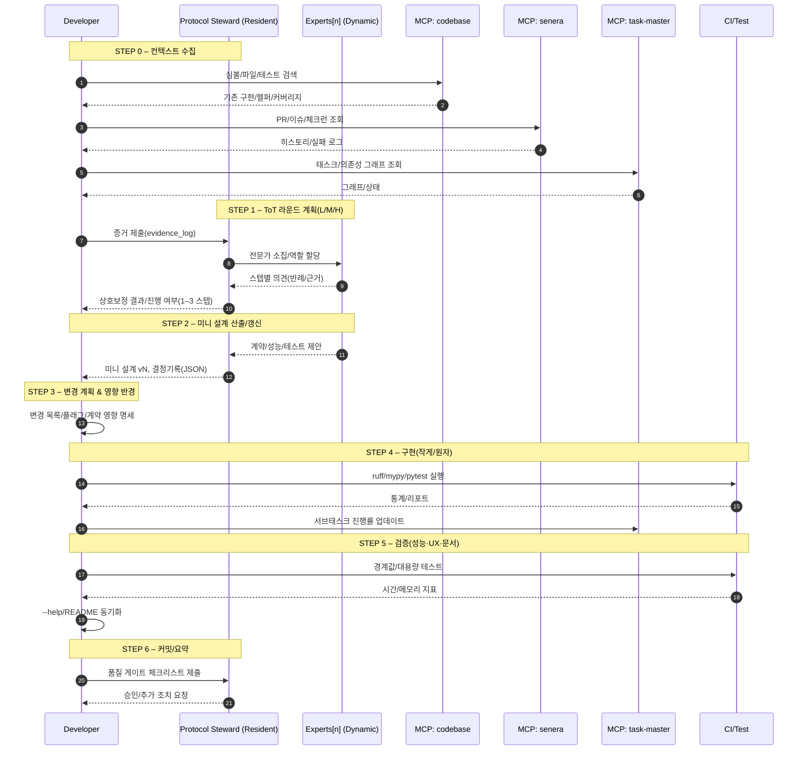

# 규약 요약 (키 포인트)
- **MCP 먼저**: 코드/문서/이슈/태스크를 MCP로 검색·열람·증거 수집.
- **기존 우선**: 재사용/리팩토링이 기본. 신규 코드는 최후 수단.
- **원자적 커밋**: 작은 변경 → 테스트 → 린트/타입 → 커밋.
- **실패 가시화**: 성공·실패·경고를 JSON 로그로 즉시 기록.
- **출력 규약**: 채팅은 **한글**, 코드/주석/커밋은 **영문**.

---

# MCP 서버 카탈로그
servers:
  - name: task-master
    purpose: 태스크/서브태스크 조회·생성·상태 업데이트(의존성 그래프)
  - name: senera
    purpose: 저장소·PR·코드 리뷰·체크런·CI 로그 열람
  - name: codebase
    purpose: 파일 트리·파일 열람·심볼/참조 검색·코드 인덱스 쿼리
  - name: sequence-think
    purpose: 작업 순서도/의사결정 트리/리스크 평가

---

# 출력 형식 규약
chat.language: "ko"         # 채팅은 한글
code_and_comments.language: "en"  # 코드/코멘트/커밋은 영어

log_line_convention: |
  각 단계/툴 호출 직후, 한 줄 로그:
  - "CLI 구조 확인:" → "[1 tool called: codebase.symbol_search]"
  - "태스크 진행률 업데이트:" → "[1 tool called: task-master.update]"

result_summary: "각 주요 단계 끝에 마크다운 소제목 + 불릿 3–7줄"
diff_format: "unified diff (patch block)"
test_lint_type_summary: "pytest/mypy/ruff 요약 통계(통과/실패/스킵/에러 수) 표기"

---

# 품질 게이트 (모든 변경 공통)
quality_gates:
  - 기존 구현 탐색 증거(파일/경로/심볼/로그 링크) 제시
  - 재사용 vs 신규 선택 이유 3줄 요약
  - 최소 1개 단위 테스트 추가/수정
  - ruff/mypy/pytest 결과 요약(숫자 필수)
  - CLI/문서 동기화(--help/README/도큐 문자열)
  - --json/비대화형에서 사이드이펙트 억제 검증
  - 커밋 메시지에 Rollback plan 1줄 포함

---

# 커밋 템플릿
commit_template: |
  <scope>: <change summary>

  Why: <문제/요구>
  How: <핵심 변경>
  Tests: <추가/수정 요약>
  Risk: <호환성/성능/회귀 리스크>
  Rollback: <되돌리는 방법 한 줄>

example_header: "cli: add JSON mode to match handler; unify common options"

---

# ToT 추론 프로토콜 (가변 전문가, 1–3 스텝 교차검증) — v2.0
experts:
  mode: "dynamic"              # 코딩 복잡도에 따라 전문가 수/구성 가변
  steps: "1–3"                 # 최대 1~3 스텝(난이도 따라 조정)
  required:
    - name: "Protocol Steward (Resident)"
      role: "계약/일관성 수호자, 논의 조정, 결정 기록 관리"
      focus: "I/O 계약·호환성·의사결정 로그·롤백 전략"
  selection:
    basis: "복잡성·리스크·영향 반경"
    typical_range: "총 2–6명"
  catalog_examples:
    - name: "Architecture & Compatibility"
      role: "시스템 아키텍처·경계 정의·호환성 보전"
      focus: "계약 안정성·레거시 영향·마이그레이션 리스크"
    - name: "Testing & Performance"
      role: "테스트 전략·품질 보증·성능/부하/프로파일링"
      focus: "단위/회귀/경계값·지연/메모리·비용"
    - name: "DX & Maintainability"
      role: "개발자 경험·CLI/SDK 설계·문서·로그"
      focus: "에러 메시지·옵션 일관성·가이드·추적성"
    - name: "Security & Privacy"
      role: "위협 모델링·데이터/비밀 관리·권한"
      focus: "취약점·암호화·감사 로그·규정 준수"
    - name: "Data & ML"
      role: "스키마/피처 계약·실험 설계·평가"
      focus: "데이터 품질·드리프트·재현성"
    - name: "Infra & Observability"
      role: "배포·롤백·모니터링·알림"
      focus: "SLO/에러 버짓·추적·용량 계획"
    - name: "Compliance & Licensing"
      role: "라이선스/법적 제약 검토"
      focus: "SPDX·서드파티 의존성·배포 제약"

rules:
  - "각 스텝에서 참여 전문가 전원이 1회씩 의견을 제시한다."
  - "Steward가 충돌을 중재하고 계약/일관성 위반을 즉시 탈락시킨다."
  - "스텝 종료 시 상호 보정(반례·근거 첨부) 후 단일 최종안 채택."
  - "채택/탈락 사유는 각 1줄로 기록(근거 링크/로그 포함)."
  - "다음 스텝 진행 여부(최대 3)는 Steward가 필요성 기준으로 결정."

deliverable:
  mini_design: "I/O·계약(스키마/exit code)·실패/경계 케이스·성능 가정·테스트 목록"
  decision_record: "선택안·대안·근거·리스크·롤백 전략(요약 JSON)"
  coverage_targets: "테스트 유형·관찰지표(시간/메모리/오류율)·문서 반영 포인트"

---

# 실행 시나리오 (ToT v2.0 반영)
## STEP 0. 컨텍스트 수집 (필수, MCP 선행)
- 목표: **이미 있는가?**에 답하는 증거 확보.
- 액션:
  1) `codebase.*` 파일/심볼/테스트 탐색 → "[1 tool called: codebase.symbol_search]"
  2) `senera.*` PR/이슈/체크런/CI 로그 확인 → "[1 tool called: senera.get_prs]"
  3) `task-master.*` 태스크/의존성 그래프 조회 → "[1 tool called: task-master.graph]"
- 산출물: `evidence_log(JSON)` 업데이트, 공백/중복/Hotspot, **권고 방향(재사용/신규)** 1줄 결론

## STEP 1. ToT 라운드 계획 (Steward 상주)
- 복잡도 분류: L=전문가 2–3명/1스텝, M=3–5명/2스텝, H=4–6명/3스텝
- 카탈로그에서 역할 매칭(필요 역할만 참여)
- 규칙: 전원 1회 의견 → Steward 충돌 중재 → 스텝 종료 시 단일 최종안 → 필요 시 다음 스텝 진행

## STEP 2. 미니 설계 산출(스텝마다 갱신)
- I/O, 계약(스키마/exit code), 실패/경계 케이스, 성능 가정, 테스트 목록
- 결정기록(JSON): 선택안/대안/근거/리스크/롤백
- 커버리지 타깃: 테스트 유형·관찰지표(시간/메모리/오류율)·문서 반영 포인트

## STEP 3. 변경 계획 & 영향 반경
- 변경 파일/함수/CLI 플래그, 예상 diff 크기
- 계약 영향(출력 스키마/exit code), 마이그레이션 플래그(`--json`, `--dry-run`)
- 보안/라이선스/배포 리스크 스냅샷(필요 시 Security/Compliance 추가 투입)

## STEP 4. 구현 (작게 자르기, 원자 커밋)
- 소단위 루프:
  - 패치 제안(unified diff) → "[0~n tools called]"
  - 정적체크(ruff/mypy) 요약
  - 단위 테스트 추가/수정(pytest -q) 요약
  - 실패 시 즉시 수정/롤백 제안
  - `task-master.update`로 서브태스크 진행도 반영 → "[1 tool called]"

## STEP 5. 검증(테스트·성능·UX)
- `pytest` 통계, 경계값 입력 성능 로그(시간/메모리)
- CLI UX: `--json` 시 색상/프로그레스 억제
- `--help` 스냅샷과 README 동기화

## STEP 6. 커밋·체인지로그·요약
- 커밋 템플릿 준수(Why/How/Tests/Risk/Rollback)
- 품질 게이트 체크리스트 완료
- “Wxx-Wyy 성과 요약” 갱신

---

# 의사결정 트리거(Exit/Proceed)
- **Proceed**: 반례 미해결, 계약 충돌 후보, 성능 가정 검증 필요
- **Finish**: 대안 우열 2:1 이상 합의 + 계약/성능/보안 체크 통과
- **Replan**: 새로운 제약(규정/라이선스/데이터) 등장 시 STEP 1로

---

# 로그/증거 스키마(추가 필드, ToT v2.0)
```json
{
  "step": "tot-round-2",
  "complexity": "M",
  "experts": [
    {"name": "Architecture & Compatibility"},
    {"name": "Testing & Performance"},
    {"name": "DX & Maintainability"},
    {"name": "Security & Privacy"}
  ],
  "steward": "Protocol Steward (Resident)",
  "opinions": [
    {"by": "Architecture & Compatibility", "claim": "Reuse adapter", "evidence": "cli/match.py"},
    {"by": "Testing & Performance", "claim": "Add boundary tests", "evidence": "tests/*"}
  ],
  "conflicts": [{"type": "contract", "status": "rejected", "reason": "Exit code drift"}],
  "decision": {"selected": "Reuse+--json mode", "rejected": ["Rewrite"], "rationale": "Contract stability"},
  "next_step": "proceed"
}
```

---

# 패치 제안 템플릿 (unified diff)
patch_example: |
  *** NOTE: comments in English ***
  diff --git a/cli/match.py b/cli/match.py
  --- a/cli/match.py
  +++ b/cli/match.py
  @@
  -def run_match(args: Args) -> None:
  +def run_match(args: Args) -> None:
       # existing behavior
  +    if args.json:
  +        # Suppress color/progress for non-interactive JSON
  +        result = compute_match(args)
  +        print(json.dumps(result))  # noqa: T201
  +        return

  diff --git a/tests/test_match_json.py b/tests/test_match_json.py
  +++ b/tests/test_match_json.py
  @@
  +def test_match_json_suppresses_side_effects(tmp_path):
  +    result = cli(["match", "--json", "--input", str(tmp_path / "a.txt")])
  +    data = json.loads(result.stdout)
  +    assert "items" in data

---

# 시퀀스 다이어그램 (Mermaid)

